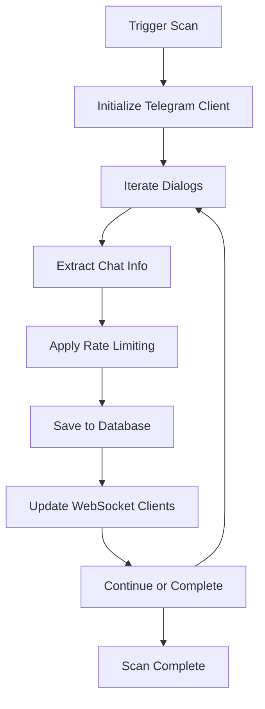
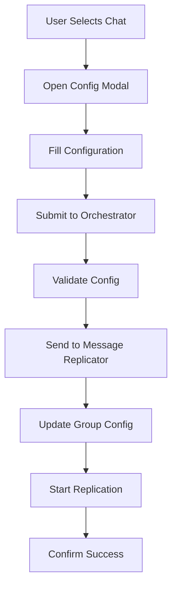
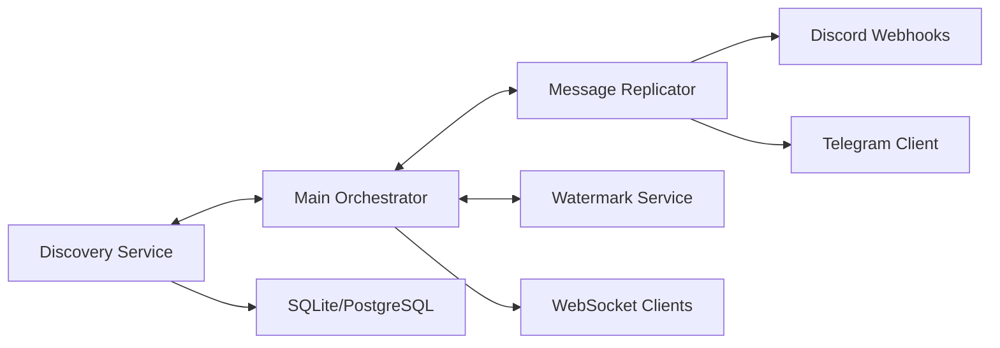

# 🔍 Discovery System v2.0 - Technical Documentation

## 📋 Overview

The Discovery System is an enterprise-grade microservice that provides auto-discovery and visual configuration of Telegram chats for the Universal Router SaaS platform.

## 🏗️ Architecture

### Microservices Structure
```
┌─────────────────────┐    ┌─────────────────────┐
│   Main Orchestrator │    │   Discovery Service │
│     Port 8000       │◄──►│     Port 8002       │
│                     │    │                     │
│ • Dashboard         │    │ • Chat Scanner      │
│ • API Gateway       │    │ • Auto-Detection    │
│ • WebSocket Hub     │    │ • Rate Limiting     │
└─────────────────────┘    └─────────────────────┘
           │                           │
           ▼                           ▼
┌─────────────────────┐    ┌─────────────────────┐
│ Message Replicator  │    │    Database Layer   │
│     Port 8001       │    │                     │
│                     │    │ • SQLite (dev)      │
│ • Telegram → Discord│    │ • PostgreSQL (prod) │
│ • Media Processing  │    │ • Migration Ready   │
│ • Webhooks          │    │ • Indexed Queries   │
└─────────────────────┘    └─────────────────────┘
```

## 🚀 Quick Start

### 1. Installation
```bash
# Clone and setup
git clone <repository>
cd <project>

# Install dependencies
pip install -r requirements.txt

# Configure environment
cp .env.discovery .env
# Edit .env with your Telegram credentials
```

### 2. Launch Options

#### Option A: Complete System
```bash
python scripts/start_complete_system.py
```

#### Option B: Discovery Service Only
```bash
python scripts/start_discovery.py
```

#### Option C: Manual Start
```bash
# Start Discovery Service
python services/discovery/main.py

# Start Main Orchestrator
python main.py
```

## 🔧 Configuration

### Environment Variables

```bash
# Telegram API
TELEGRAM_API_ID=your_api_id
TELEGRAM_API_HASH=your_api_hash
TELEGRAM_PHONE=your_phone_number

# Discovery Service
DISCOVERY_PORT=8002
SCAN_INTERVAL=1800  # 30 minutes
RATE_LIMIT_DELAY=1.0  # seconds

# Database
DATABASE_PATH=data/discovery.db
CACHE_DURATION=3600  # 1 hour

# External Services
ORCHESTRATOR_URL=http://localhost:8000
REPLICATOR_URL=http://localhost:8001
```

## 📡 API Reference

### Discovery Service Endpoints

#### GET /health
Health check endpoint
```json
{
  "status": "healthy",
  "service": "discovery",
  "timestamp": "2024-01-01T12:00:00Z",
  "version": "2.0.0"
}
```

#### GET /status
Complete service status
```json
{
  "service": "discovery",
  "status": "healthy",
  "scanner_stats": {
    "total_scans": 42,
    "successful_scans": 40,
    "chats_discovered": 1337,
    "last_scan": "2024-01-01T12:00:00Z"
  },
  "database_stats": {
    "total_chats": 1337,
    "db_size_mb": 15.5
  }
}
```

#### POST /api/discovery/scan
Trigger chat discovery scan
```json
// Request
{
  "force_refresh": true,
  "target_chat_ids": [123, 456] // optional
}

// Response
{
  "message": "Scan started",
  "status": {
    "is_scanning": true,
    "progress_percent": 0.0,
    "start_time": "2024-01-01T12:00:00Z"
  }
}
```

#### GET /api/discovery/chats
List discovered chats with filters
```bash
GET /api/discovery/chats?chat_type=channel&min_participants=100&limit=50
```

```json
{
  "chats": [
    {
      "id": 123456789,
      "title": "Example Channel",
      "type": "channel",
      "username": "example_channel",
      "description": "Channel description",
      "participants_count": 1500,
      "is_broadcast": true,
      "is_verified": true,
      "discovered_at": "2024-01-01T12:00:00Z",
      "last_activity": "2024-01-01T11:30:00Z"
    }
  ],
  "total": 1,
  "limit": 50,
  "offset": 0
}
```

#### POST /api/discovery/configure
Configure discovered chat for replication
```json
// Request
{
  "chat_id": 123456789,
  "chat_title": "Example Channel",
  "enabled": true,
  "destination_webhook": "https://discord.com/api/webhooks/...",
  "filters": {
    "keywords": ["important"],
    "exclude_bots": true
  },
  "transformations": {
    "add_prefix": "[Channel] ",
    "watermark": true
  }
}

// Response
{
  "success": true,
  "message": "Chat configured successfully"
}
```

### Orchestrator Integration Endpoints

#### GET /api/discovery/status
Discovery status via orchestrator
```json
{
  "available": true,
  "health": {
    "status": "healthy",
    "capabilities": ["chat_discovery", "telegram_scanning", "real_time_updates"]
  },
  "stats": { /* discovery stats */ }
}
```

#### POST /api/discovery/bulk_configure
Bulk configuration of multiple chats
```json
// Request
{
  "chat_ids": [123, 456, 789],
  "operation": "enable", // "enable", "disable", "configure"
  "config": {
    "destination_webhook": "https://discord.com/...",
    "filters": {},
    "transformations": {}
  }
}

// Response
{
  "successful": 2,
  "failed": 1,
  "details": [
    {"chat_id": 123, "status": "success"},
    {"chat_id": 456, "status": "success"},
    {"chat_id": 789, "status": "failed", "error": "Invalid webhook"}
  ]
}
```

## 🎨 Frontend Integration

### Discovery Dashboard

Access the visual discovery interface at:
- **Direct URL**: `http://localhost:8002/` (not implemented in current version)
- **Integrated URL**: `http://localhost:8000/discovery`

#### Features
- **Chat Browser**: Visual grid/list view of discovered chats
- **Advanced Filters**: Type, participants, activity, search terms
- **Bulk Operations**: Select multiple chats for batch configuration
- **Real-time Updates**: WebSocket-powered live updates
- **Drag & Drop**: Visual configuration interface
- **Preview System**: Test configurations before applying

### WebSocket Events

Connect to `ws://localhost:8002/ws` for real-time updates:

```javascript
const ws = new WebSocket('ws://localhost:8002/ws');

ws.onmessage = (event) => {
  const data = JSON.parse(event.data);
  
  switch(data.type) {
    case 'scan_status':
      // Update scan progress
      updateScanProgress(data.status);
      break;
      
    case 'scan_completed':
      // Refresh chat list
      refreshChats();
      break;
      
    case 'new_chats':
      // Notify new chats found
      showNotification(`${data.count} new chats discovered`);
      break;
  }
};
```

## 🗄️ Database Schema

### SQLite Schema (Development)

```sql
-- Chats table
CREATE TABLE chats (
    id INTEGER PRIMARY KEY,
    title TEXT NOT NULL,
    type TEXT NOT NULL,
    username TEXT,
    description TEXT,
    participants_count INTEGER,
    is_broadcast BOOLEAN DEFAULT FALSE,
    is_megagroup BOOLEAN DEFAULT FALSE,
    is_private BOOLEAN DEFAULT FALSE,
    date_created TIMESTAMP,
    last_message_date TIMESTAMP,
    has_geo BOOLEAN DEFAULT FALSE,
    is_scam BOOLEAN DEFAULT FALSE,
    is_verified BOOLEAN DEFAULT FALSE,
    restriction_reason TEXT,
    discovered_at TIMESTAMP NOT NULL,
    scan_count INTEGER DEFAULT 1,
    is_active BOOLEAN DEFAULT TRUE,
    last_activity TIMESTAMP,
    raw_data TEXT
);

-- Scan history table
CREATE TABLE scan_history (
    id INTEGER PRIMARY KEY AUTOINCREMENT,
    scan_id TEXT UNIQUE NOT NULL,
    start_time TIMESTAMP NOT NULL,
    end_time TIMESTAMP,
    total_chats INTEGER DEFAULT 0,
    new_chats INTEGER DEFAULT 0,
    updated_chats INTEGER DEFAULT 0,
    errors INTEGER DEFAULT 0,
    status TEXT DEFAULT 'running'
);

-- Indexes for performance
CREATE INDEX idx_chats_type ON chats(type);
CREATE INDEX idx_chats_username ON chats(username);
CREATE INDEX idx_chats_active ON chats(is_active);
CREATE INDEX idx_chats_discovered ON chats(discovered_at);
```

### PostgreSQL Migration (Production)

```sql
-- Enhanced schema for production
CREATE TABLE chats (
    id BIGINT PRIMARY KEY,
    title VARCHAR(255) NOT NULL,
    type VARCHAR(50) NOT NULL,
    username VARCHAR(100),
    description TEXT,
    participants_count INTEGER,
    is_broadcast BOOLEAN DEFAULT FALSE,
    is_megagroup BOOLEAN DEFAULT FALSE,
    is_private BOOLEAN DEFAULT FALSE,
    date_created TIMESTAMPTZ,
    last_message_date TIMESTAMPTZ,
    has_geo BOOLEAN DEFAULT FALSE,
    is_scam BOOLEAN DEFAULT FALSE,
    is_verified BOOLEAN DEFAULT FALSE,
    restriction_reason TEXT,
    discovered_at TIMESTAMPTZ NOT NULL DEFAULT NOW(),
    scan_count INTEGER DEFAULT 1,
    is_active BOOLEAN DEFAULT TRUE,
    last_activity TIMESTAMPTZ,
    raw_data JSONB,
    created_at TIMESTAMPTZ DEFAULT NOW(),
    updated_at TIMESTAMPTZ DEFAULT NOW()
);

-- Full-text search index
CREATE INDEX idx_chats_fts ON chats USING gin(
    to_tsvector('english', title || ' ' || COALESCE(description, ''))
);

-- Performance indexes
CREATE INDEX idx_chats_type ON chats(type);
CREATE INDEX idx_chats_participants ON chats(participants_count DESC);
CREATE INDEX idx_chats_activity ON chats(last_activity DESC);
CREATE INDEX idx_chats_discovered ON chats(discovered_at DESC);
```

## 🔄 Data Flow

### 1. Chat Discovery Process



### 2. Configuration Flow



### 3. Integration Architecture



## 🔧 Development

### Code Structure

```
services/discovery/
├── main.py                 # FastAPI application
├── models/
│   ├── __init__.py
│   ├── chat_info.py        # Chat data models
│   └── requests.py         # API request models
├── services/
│   ├── __init__.py
│   ├── telegram_scanner.py # Telegram client wrapper
│   ├── database.py         # Database abstraction
│   └── websocket.py        # WebSocket manager
├── api/
│   ├── __init__.py
│   ├── discovery.py        # Discovery endpoints
│   └── health.py           # Health check endpoints
└── config/
    ├── __init__.py
    └── settings.py         # Configuration management
```

### Key Classes

#### `DiscoveryService`
Main service coordinator
```python
class DiscoveryService:
    def __init__(self):
        self.config = DiscoveryConfig()
        self.database = DiscoveryDatabase()
        self.scanner = TelegramScanner()
        self.ws_manager = WebSocketManager()
    
    async def initialize(self):
        # Initialize all components
    
    async def trigger_manual_scan(self):
        # Start discovery scan
    
    async def get_chats_filtered(self, filters):
        # Get filtered chat list
```

#### `TelegramScanner`
Handles Telegram API interactions
```python
class TelegramScanner:
    def __init__(self, config, database):
        self.client = TelegramClient(...)
        self.rate_limiter = RateLimiter()
    
    async def scan_all_chats(self):
        # Discover all available chats
    
    async def extract_chat_info(self, dialog):
        # Extract structured chat information
```

#### `DiscoveryDatabase`
Database abstraction layer
```python
class DiscoveryDatabase:
    def __init__(self, db_path):
        self.db_path = db_path
        self._init_db()
    
    async def save_chat(self, chat_info):
        # Save or update chat information
    
    async def get_chats(self, filters):
        # Query chats with filters
```

### Testing

#### Unit Tests
```bash
# Run discovery service tests
python -m pytest tests/test_discovery.py -v

# Run integration tests
python -m pytest tests/test_integration.py -v

# Run all tests with coverage
python -m pytest --cov=services/discovery tests/
```

#### API Testing
```bash
# Test discovery endpoints
curl -X POST http://localhost:8002/api/discovery/scan
curl -X GET http://localhost:8002/api/discovery/chats?limit=5
curl -X GET http://localhost:8002/health
```

## 🚀 Deployment

### Development Deployment
```bash
# Single command startup
python scripts/start_complete_system.py

# Or individual services
python scripts/start_discovery.py
python main.py
```

### Production Deployment

#### Docker Compose (Recommended)
```yaml
version: '3.8'
services:
  discovery:
    build: 
      context: .
      dockerfile: services/discovery/Dockerfile
    ports:
      - "8002:8002"
    environment:
      - DATABASE_URL=postgresql://user:pass@db:5432/discovery
    depends_on:
      - db
    
  orchestrator:
    build: .
    ports:
      - "8000:8000"
    depends_on:
      - discovery
    
  db:
    image: postgres:15
    environment:
      POSTGRES_DB: discovery
      POSTGRES_USER: user
      POSTGRES_PASSWORD: pass
    volumes:
      - postgres_data:/var/lib/postgresql/data

volumes:
  postgres_data:
```

#### Kubernetes Deployment
```yaml
apiVersion: apps/v1
kind: Deployment
metadata:
  name: discovery-service
spec:
  replicas: 2
  selector:
    matchLabels:
      app: discovery-service
  template:
    metadata:
      labels:
        app: discovery-service
    spec:
      containers:
      - name: discovery
        image: your-registry/discovery-service:latest
        ports:
        - containerPort: 8002
        env:
        - name: DATABASE_URL
          valueFrom:
            secretKeyRef:
              name: db-secret
              key: url
---
apiVersion: v1
kind: Service
metadata:
  name: discovery-service
spec:
  selector:
    app: discovery-service
  ports:
  - port: 8002
    targetPort: 8002
```

## 📊 Monitoring & Observability

### Health Checks
- **Discovery Service**: `GET /health`
- **Orchestrator Integration**: `GET /api/discovery/status`
- **Database Health**: Included in status endpoints

### Metrics
- Scan frequency and success rate
- Chat discovery rate
- API response times
- Database query performance
- WebSocket connection count

### Logging
```python
# Structured logging format
{
  "timestamp": "2024-01-01T12:00:00Z",
  "level": "INFO",
  "service": "discovery",
  "component": "scanner",
  "message": "Chat scan completed",
  "metadata": {
    "scan_id": "uuid",
    "chats_found": 42,
    "duration_ms": 15000
  }
}
```

## 🔒 Security

### API Security
- Rate limiting on all endpoints
- Input validation with Pydantic
- SQL injection prevention with parameterized queries
- CORS configuration for frontend integration

### Telegram Security
- Session file encryption
- API key rotation support
- Rate limiting compliance with Telegram limits
- Error handling for flood wait errors

### Data Privacy
- Minimal data collection
- Configurable data retention
- Optional data anonymization
- GDPR compliance considerations

## 🐛 Troubleshooting

### Common Issues

#### "Discovery Service Not Starting"
```bash
# Check dependencies
pip install -r requirements.txt

# Verify Telegram credentials
python -c "from telethon import TelegramClient; print('OK')"

# Check port availability
netstat -ln | grep 8002
```

#### "No Chats Discovered"
```bash
# Check Telegram session
ls sessions/discovery_session.session

# Verify API credentials
curl -X GET http://localhost:8002/status

# Check logs
tail -f logs/discovery.log
```

#### "Integration Not Working"
```bash
# Test discovery service directly
curl -X GET http://localhost:8002/health

# Test orchestrator integration
curl -X GET http://localhost:8000/api/discovery/status

# Check WebSocket connection
wscat -c ws://localhost:8002/ws
```

### Debug Mode
```bash
# Enable debug logging
export DEBUG_MODE=true
export LOG_LEVEL=DEBUG

# Start with verbose output
python services/discovery/main.py --debug
```

## 📈 Performance Optimization

### Database Optimization
- Index optimization for common queries
- Connection pooling for high load
- Query result caching
- Batch operations for bulk updates

### Rate Limiting
- Intelligent rate limiting based on Telegram limits
- Exponential backoff for flood wait errors
- Parallel processing with concurrency limits
- Request queuing for burst handling

### Memory Management
- Chat data pagination
- LRU cache for frequent queries
- Background cleanup of old data
- Memory profiling tools integration

## 🔮 Future Enhancements

### Planned Features
- **Advanced Filtering**: Machine learning-based chat categorization
- **Real-time Sync**: Live chat updates via Telegram's streaming API
- **Multi-account Support**: Multiple Telegram accounts for scaling
- **Analytics Dashboard**: Advanced metrics and reporting
- **Export/Import**: Configuration backup and migration tools

### Scalability Roadmap
- **Horizontal Scaling**: Multi-instance deployment
- **Database Sharding**: Partition by chat ID ranges
- **Message Queuing**: Redis/RabbitMQ for async processing
- **CDN Integration**: Static asset optimization
- **Global Distribution**: Multi-region deployment

---

## 📞 Support

### Documentation
- **API Reference**: `/docs` endpoint on running service
- **OpenAPI Spec**: `/openapi.json` endpoint
- **Health Status**: `/health` and `/status` endpoints

### Community
- **Issues**: GitHub Issues for bug reports
- **Discussions**: GitHub Discussions for questions
- **Documentation**: Wiki for detailed guides

---

*Discovery System v2.0 - Built with enterprise-grade architecture for the Universal Router SaaS platform*